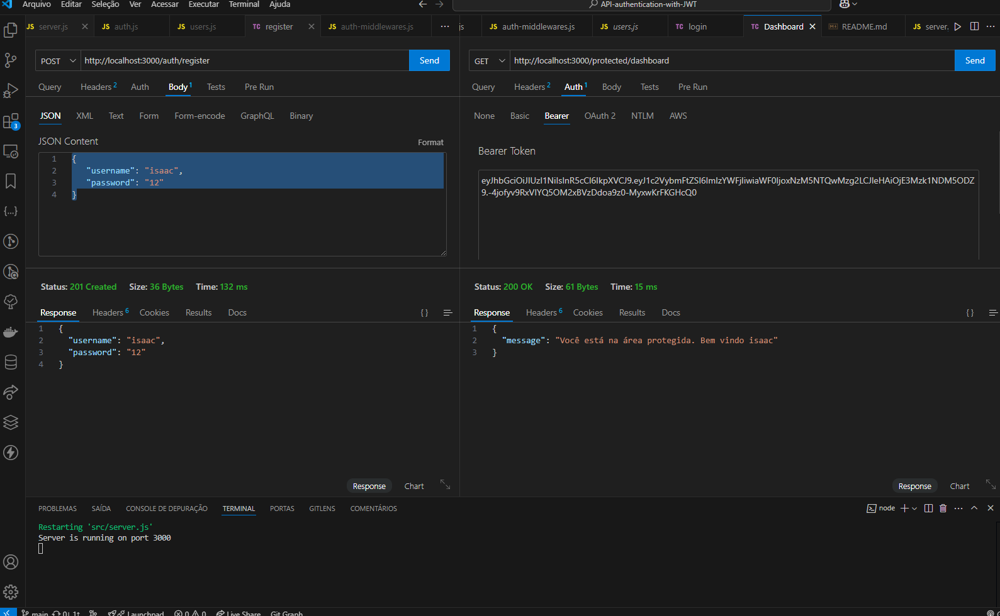

# API-authentication-with-JWT

## Descrição
Este é um projeto prático para estudos em backend, focado na implementação de autenticação usando JWT (JSON Web Token). O projeto inclui funcionalidades de registro, login e proteção de rotas com middleware de autenticação.

<!-- ## Link Online
API-authentication-with-JWT -->

## Imagens do Projeto



## Funcionalidades
- ✨ Registro de novos usuários
- 🔐 Login de usuários existentes
- 🛡️ Proteção de rotas com autenticação JWT
- 📜 Middleware para verificação de token

## Tecnologias Utilizadas
- Node.js
- Express
- JSON Web Token (JWT)

## Como Executar o Projeto
1. Clone o repositório:
   ```bash
   git clone https://github.com/mdanieldantas/API-authentication-with-JWT.git
   ```
2. Navegue até o diretório do projeto:
   ```bash
   cd API-authentication-with-JWT
   ```
3. Instale as dependências:
   ```bash
   npm install
   ```
4. Execute o projeto:
   ```bash
   npm run dev
   ```
5. O servidor estará rodando em `http://localhost:3000`.

## Estrutura do Projeto
```
API-authentication-with-JWT/
├── models/
│   └── users.js
├── routes/
│   ├── auth.js
│   └── protected.js
├── middlewares/
│   └── auth-middleware.js
├── app.js
└── package.json
```

## Aprendizados
Durante o desenvolvimento deste projeto, foram adquiridos conhecimentos sobre:
- Implementação de autenticação com JWT
- Criação de middlewares no Express
- Proteção de rotas em aplicações backend

## Contribuições
Contribuições são bem-vindas! Sinta-se à vontade para abrir issues e pull requests.

## Licença
Este projeto está licenciado sob a licença MIT.

## Contato

**M Daniel Dantas**

- **GitHub:** [mdanieldantas](https://github.com/mdanieldantas)
- **LinkedIn:** [mdanieldantas](https://www.linkedin.com/in/mdanieldantas)
- **Portfólio:** [Portfólio de Daniel Dantas](https://danieldantasdev.vercel.app)
- **Email:** [contatomarcosdgomes@gmail.com](mailto:contatomarcosdgomes@gmail.com)
<!-- - **Link do Projeto:** [calculator](Linkdo do projeto) -->
- **Currículo:** [Baixar Currículo](https://drive.google.com/file/d/1Z_tqBv6kg4wkDAQHAvY3lcuVSq3rabTt/view?usp=drive_link)
<!-- - **Veja Online:** [Nome do projeto](link) -->